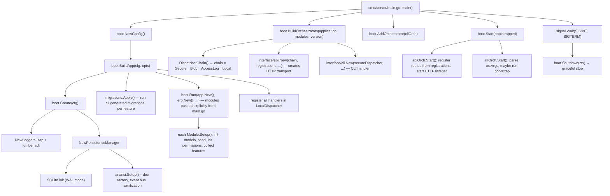

# Framework Description — ERP Template

This document describes the application as a **framework** — the reusable abstractions, wiring
conventions, data flow patterns, and extension points. Implementation details (specific
handlers, models, features) serve as examples of the framework in use.

> **Migration status**: this document describes the *target* architecture, agreed after a
> design review (see `MIGRATION.md` for the move-by-move runbook). Section 11 records the
> design-pattern critique that motivated the changes. Until migration is complete, the
> "File Tree" section in this document is the target, not the current state.

---

## Table of Contents

1. [Building Blocks](#1-building-blocks)
2. [Directory Taxonomy](#2-directory-taxonomy)
3. [Data Flow — Request Lifecycle](#3-data-flow--request-lifecycle)
4. [Wiring Map — How Things Connect](#4-wiring-map--how-things-connect)
5. [Framework vs Application Code](#5-framework-vs-application-code)
6. [Extension Points](#6-extension-points)
7. [Conventions & Patterns](#7-conventions--patterns)
8. [Performance & Optimization Notes](#8-performance--optimization-notes)
9. [Testing Strategy](#9-testing-strategy)
10. [Operational Notes](#10-operational-notes)
11. [Design Pattern Critique & Recommendations](#11-design-pattern-critique--recommendations)
12. [Glossary](#12-glossary)
13. [File Tree (Target)](#13-file-tree-target)

---

## 1. Building Blocks

### 1.1 Abstractions Layer Cake

```
┌──────────────────────────────────────────────────────────┐
│                     Transport                              │
│  (HTTP, CLI — protocol-specific I/O)                      │
│  Knows about: headers, cookies, status codes, streaming   │
├──────────────────────────────────────────────────────────┤
│                     Orchestrator (interface/)               │
│  (Bridges Transport ↔ Dispatcher)                         │
│  Knows about: auth, session management, route registration│
├──────────────────────────────────────────────────────────┤
│                  Dispatcher Chain (core/)                   │
│  (Middleware for Messages)                                 │
│  Each layer: SecureDispatcher → BlobDispatcher →          │
│              AccessLogDispatcher → LocalDispatcher         │
├──────────────────────────────────────────────────────────┤
│                   Handlers (Features, in a Module)          │
│  (Business Logic — stateless funcs)                       │
│  Input:  Message → Output: Result                         │
├──────────────────────────────────────────────────────────┤
│                  Models (Domain Layer, per Feature)          │
│  (Data Access — per-collection)                           │
│  Wraps base.Persistence with domain semantics             │
├──────────────────────────────────────────────────────────┤
│               Persistence (go-anansi)                      │
│  (Document Store over SQLite)                               │
│  base.Persistence, base.Collection, data.Document          │
└──────────────────────────────────────────────────────────┘
```

### 1.2 The Three Core Interfaces

These three interfaces are the skeleton of the entire server. Everything else is a concrete
implementation. They live in `internal/abstract/` and nowhere else — no logic, no state.

**Dispatcher** — the central routing primitive:
```go
type Dispatcher interface {
    Send(msg Message) (*Result, error)
}
```
Implementations wrap each other (Decorator pattern). The base `LocalDispatcher` holds a
`map[string]handlerEntry` guarded by `sync.RWMutex`.

**Module** — the unit of feature packaging:
```go
type Module interface {
    Name() string
    Setup(ctx context.Context, persist base.Persistence) error
    Capabilities() []Capability // each Capability → []MessageRegistration
}
```

**Transport** — the protocol I/O boundary:
```go
type Transport interface {
    Handle(pattern string, handler Handler)
    Start() error
    Shutdown(ctx context.Context) error
}
```

### 1.3 The Message — Universal Data Envelope

Every operation in the system is a named message:

```go
type Message interface {
    ID() string                 // UUID v7
    Name() string               // "system:auth:session:create"
    Context() context.Context   // carries identity, transport metadata
    Input() *data.Document      // { arguments, modifiers, payload }
}
```

The message name is a colon-delimited **quadruple** `module:feature:scope:action` —
this document previously called it a "triple," which was imprecise (the earlier text and
the examples never actually agreed with each other). Each segment has one job:

| Segment | Meaning | Example |
|---|---|---|
| `module` | Owning module (§2) | `system` |
| `feature` | Feature package within the module (§2.1) | `auth` |
| `scope` | The resource/sub-concept the action operates on | `session` |
| `action` | The verb — must correspond to the registration's `Intent` | `create` |

This name serves four purposes simultaneously:
- The routing key to find the handler
- The permission scope to authorize access
- The HTTP route, via mechanical derivation from `module:feature:scope` (§3.3)
- The generated SDK class and method name, via mechanical derivation from all four
  segments (§1.3.1)

> **This four-purpose overload is a deliberate but risky invariant.** See §11.3 — treat
> message name changes as breaking API changes, not internal refactors. It's now also a
> breaking change to the generated client SDK, not just the HTTP surface.

#### 1.3.1 SDK Naming Derivation

`cmd/sdkgen` derives client SDK class and method names mechanically from the four segments
— no message should need a separate, manually-maintained SDK name:

```
class  = PascalCase(module) + PascalCase(feature)
method = camelCase(action)  + PascalCase(scope)
```

Examples:
```
system:auth:session:create   → class SystemAuth,   method createSession()
system:users:user:get        → class SystemUsers,  method getUser()
system:users:user:create     → class SystemUsers,  method createUser()
system:auth:session:delete   → class SystemAuth,   method deleteSession()
```

**Edge case — dynamic collections**: `collection:<name>:document:<action>` messages have a
`feature` segment (`<name>`) that's only known at runtime (a user-created collection), not
at build time. These cannot be part of the statically generated SDK the same way — `sdkgen`
should either emit a generic parameterized `CollectionClient` for these, or exclude the
`collection:*` namespace from static generation entirely and document that dynamic
collections are accessed through a runtime client. Decide this explicitly when extending
`sdkgen` (§11.7/§11.9 migration work) rather than leaving it as an implicit gap.

**Action vocabulary**: to keep generated method names predictable, `action` should be drawn
from a fixed, small vocabulary that maps 1:1 to `Intent`: `create` (Create), `get` (Read),
`update` (Update), `delete` (Delete), `query` or `list` (Query), `stream` (Stream). A
message registered with `action` outside this vocabulary, or with an `action` that doesn't
match its own `Intent`, should fail a validation check rather than silently generate an
inconsistent SDK method name — see §11.3 for where this check belongs.

### 1.4 Input Document Structure

Every message input is a `data.Document` with three sections:

```
{
  "arguments": { "user_id": "abc-123" },     // path/route params
  "modifiers": { "permanent": "true" },       // query string params
  "payload":   { "email": "...", ... }         // request body
}
```

Handlers access these via `doc.GetOr("arguments.user_id", "")`, `doc.GetOr("payload.email", "")`, etc.

### 1.5 Result — Response Envelope

```go
type Result struct {
    Kind            ResultKind             // NEW — explicit discriminant, see §11.5
    Document        *data.Document
    Documents       data.DocumentSet
    Page            *Page
    Blob            Blob
    DocumentChannel <-chan *data.Document
    BlobChannel     <-chan Blob
}
```

`Kind` makes response-shape selection explicit rather than inferred from which field is
non-nil. Construct results via `registration.NewDocumentResult(doc)`,
`registration.NewPageResult(page)`, etc. — never populate `Result` fields directly outside
these constructors. See §11.5 for the rationale.

---

## 2. Directory Taxonomy

Every path prefix under `internal/` and the repo root has exactly one meaning. An agent
(or engineer) should be able to classify any new file by path alone, without opening it.

| Path | Meaning | Mutability |
|---|---|---|
| `internal/abstract/` | Interfaces + envelope types. Zero implementation, zero business logic. | Template — read-only except on canonical branch |
| `internal/core/` | Framework implementations of `abstract/*`. Module-agnostic — never imports `internal/app` or `module/*`. | Template — read-only except on canonical branch |
| `internal/app/` | The **default module** — generic system features (auth, users, apikeys, policies, audit, blobs, collections). No special privileges vs. any other module. | Template — read-only except on canonical branch |
| `internal/interface/` | Boundary adapters — translate an external protocol (`api`, `cli`, future `rpc`/`wails`) into `abstract.Message`. | Template — read-only except on canonical branch |
| `internal/boot/` | Generic startup/wiring *mechanics*. Takes modules as a parameter; knows no module by name. | Template — read-only except on canonical branch |
| `internal/shared/` | Dependency-free generic helpers (schema validation, test utilities). Not domain, not an abstraction. | Template — read-only except on canonical branch |
| `module/<name>/` | Extension modules (e.g. `module/erp/`). Same internal shape as `internal/app/` (module.go, doc.go, feature/*). | Yours — never touched by template sync |
| `cmd/<binary>/` | Entry points. `cmd/server/main.go` is the **only** file that lists which modules are active in a given deployment. | Yours |

**Dependency direction (one-way, no exceptions):**
```
interface/ ──┐
             ├──> abstract/  <── core/  <── module/*  (internal/app + module/erp, as equal peers)
boot/ ───────┘
```
A module imports only `abstract/`, `core/`, and `shared/` — never another module, never
`interface/`. If a second module ever needs something another module owns, that dependency
is expressed through an interface in `abstract/`, never a direct cross-module import.

**Enforcement**: `internal/` is documentation-labeled read-only except on the canonical
(template) branch. This runs locally, without a PR pipeline, so enforcement is a local
git pre-commit hook that rejects staged changes under `internal/` on any branch other than
the canonical one — see `MIGRATION.md` Phase 8 for the script. It's a bypassable guard
(`git commit --no-verify` skips it), not a server-side gate — worth remembering that's the
honest limit of what "read-only" means without CI.

### 2.1 The File-Role Contract (per feature)

Every feature directory, in `internal/app/feature/<name>/` or `module/<name>/feature/<name>/`,
uses an identical file set so location is predictable without listing the directory:

| File | Contains |
|---|---|
| `doc.go` | Package comment: messages owned, one-line purpose, dependencies, wiring touch-points |
| `register.go` | `Registrations(deps)` |
| `handler.go` | Business logic closures |
| `model.go` | Persistence for this feature's collection(s) |
| `schema.go` | Go I/O contract types — request/response validation |
| `defaults.go` | `DefaultOperations()` — permission scopes |
| `policies.go` | Custom policy rules (optional) |
| `seed.go` | Feature-owned seed data (optional) |
| `schema/*.schema.json` | DB collection schema, source for migration generation — distinct from `schema.go`, see §11.9 |
| anything else | Named after the concern (`jwt.go`, `blocklist.go`, `password.go`) — never a generic name like `helpers.go` |

---

## 3. Data Flow — Request Lifecycle

### 3.1 Full Lifecycle for a Login Request

```mermaid
sequenceDiagram
    participant C as Client
    participant H as HTTP Transport
    participant O as API Orchestrator (interface/api)
    participant AM as Auth Middleware
    participant RC as Route Closure
    participant ALD as AccessLog Dispatcher
    participant SD as SecureDispatcher
    participant LD as LocalDispatcher
    participant HND as Auth Handler
    participant RS as Response Serializer

    C->>H: POST /api/auth/session (JSON body)
    H->>H: corsMiddleware, correlationIDMiddleware
    H->>O: transport.Request{Operation, Body, Cookies, Headers, ...}
    O->>AM: wrap(handlerFn)
    AM->>AM: extractIdentity(req) → Claims (bearer, cookie, or api-key; anonymous if none)
    AM->>RC: fn(ctx, req) with identity attached
    RC->>RC: buildDoc → {arguments:{}, modifiers:{}, payload:{email, password}}
    RC->>RC: create transportMessage{name:"system:auth:session:create", input:doc}
    RC->>ALD: disp.Send(msg)

    ALD->>ALD: start = time.Now()
    ALD->>SD: next.Send(msg)

    SD->>SD: IsSystemIdentity(ctx)? → No (anonymous)
    SD->>SD: permMgr.Resolve("system:auth:session:create") → "public"
    SD->>SD: ac.Can(ctx, "public", nil, nil) → true
    SD->>LD: next.Send(msg)

    LD->>LD: lookup "system:auth:session:create" in handlers map
    LD->>HND: entry.fn(ctx, msg)

    HND->>HND: extract email/password from payload
    HND->>HND: users.GetByEmail(ctx, email)
    HND->>HND: auth.CheckPassword(password, storedHash)
    HND->>HND: jwtSvc.GenerateAccessToken(userID, email, scopes)
    HND->>HND: jwtSvc.GenerateRefreshToken(userID, email)
    HND-->>LD: registration.NewDocumentResult({token, user})

    LD-->>SD: result
    SD-->>ALD: result
    ALD->>ALD: log entry (timing, identity, status, transport)
    ALD-->>RC: result

    RC->>RS: serializeResponse(result, output, Create, "/api/auth/session")
    RS->>RS: switch result.Kind — sanitize (single owner), Status=201
    RC->>RC: attachCookieToResponse → add access_token + refresh_token cookies
    RC-->>O: transport.Response{Status:201, Body:sanitized, Cookies:[...]}

    O-->>H: transport.Response
    H->>H: writeSuccess → set cookies, set Content-Type, JSON encode
    H-->>C: HTTP 201, Set-Cookie: ..., {"data":{token,user},"metadata":{...}}
```

Changes from the previous version of this diagram (see §11 for rationale on each):
- Auth extraction is a single `extractIdentity(req)` call, not three sequential
  bearer/cookie/api-key attempts inlined in the middleware — same behavior, one entry point,
  reusable by any future transport (§11.4).
- `BlobDispatcher` and the undocumented `NamespacedDispatcher("blogs:")` step from the
  original diagram are omitted here pending verification against source — see §11.2.
- Sanitization happens once, inside `serializeResponse`, switching on `result.Kind` — not
  duplicated in the handler (§11.5, §11.6).

### 3.2 Key Design Decisions in the Flow

**Auth placement**: Authentication happens BEFORE message dispatch, inside the
orchestrator's `wrap()` function. Authorization happens INSIDE the dispatcher chain via
`SecureDispatcher`. This means:
- Auth credentials are extracted once, at the edge
- Internal messages (sent by handlers) use `SystemContext` and an internal-only dispatch
  path that bypasses `SecureDispatcher` and `AccessLogDispatcher` by construction, not just
  by identity check (§11.4)
- Authorization rules can be hot-reloaded (they're cached in `go-iam` with 5s TTL)

**Anonymous default**: No valid credentials → empty Claims. Handlers don't handle
authentication, they just receive a context with whatever identity the middleware
extracted. `SecureDispatcher` enforces access.

**Error propagation**: Errors from handlers bubble up through the entire dispatcher chain,
then through the orchestrator, to `writeError` in the HTTP transport. They're NOT caught by
`AccessLogDispatcher` (it logs after the error, recording it).

### 3.3 Route Derivation Mechanics

Message names map to HTTP routes mechanically — no manual route registration. Only the
first three segments (`module:feature:scope`) contribute to the URL path; the fourth
(`action`) determines the HTTP method via `Intent`, not via string matching against the
name — `action` and `Intent` are expected to agree by convention (§1.3.1), but `Intent` is
the authoritative source for the HTTP method:

```
Message: "system:users:user:get", Arguments: {user_id: string}
  1. DeriveRoute → split by ":" → ["system","users","user","get"]
                 → take first 3 parts (module:feature:scope) → "/system/users/user"
                 → append argument paths → "/system/users/user/{user_id}"
  2. IntentToHTTPMethod(Read) → "GET"   (from the Intent field, not from parsing "get")
  3. Pattern: "GET /system/users/user/{user_id}"
```

```
URL prefix mapping (module:feature:scope → path):
  system:auth:session:create   → /api/auth/session
  system:users:user:get        → /api/users/user/{user_id}
  collection:articles:document:read → /api/collection/articles/document/{doc_id}
```

The URL prefix (`/api/`) is added by `IntentToHTTPPath` for non-admin routes. This logic
lives in `interface/api/derive.go` — it is HTTP-specific, not a `core/` abstraction (§11
migration note).

---

## 4. Wiring Map — How Things Connect

### 4.1 Startup Sequence



The critical difference from the previous wiring: **`cmd/server/main.go` is the only place
that names a module.** `internal/boot/run.go` accepts `...abstract.Module` and has no
import of `internal/app` or `module/erp` — this is what keeps `internal/boot/` inside the
read-only template while still letting deployments choose their module set.

### 4.2 Dispatcher Chain Assembly

```go
func DispatcherChain(next abstract.Dispatcher, permMgr *PermissionManager, ac AccessController,
    blobSvc BlobService, accessLogModel AccessLogModel) abstract.Dispatcher {
    var disp abstract.Dispatcher = core.NewSecureDispatcher(next, permMgr, ac)
    disp = core.NewBlobDispatcher(blobSvc, disp)
    disp = core.NewAccessLogDispatcher(disp, accessLogModel)
    return disp
}
```

Layers are applied IN REVERSE of execution order — `AccessLogDispatcher` is the outermost
wrapper, so it runs first (entering) and last (exiting):

```
Execution order (entering):
  AccessLogDispatcher → SecureDispatcher → LocalDispatcher

Execution order (exiting):
  LocalDispatcher → SecureDispatcher → AccessLogDispatcher
```

> This ordering is currently enforced only by convention in one function body. §11.1
> recommends making illegal orderings harder to construct.

### 4.3 How the CLI Orchestrator Uses the Dispatcher

The CLI orchestrator uses the **same full chain** as HTTP, not a reduced one — see §11.1
for why the previous CLI-specific shortcut (`SecureDispatcher(next)` only, skipping audit
logging) was removed. CLI actions are now audited identically to HTTP actions; the
difference between transports is purely at the identity-extraction boundary
(`interface/cli` uses `SystemContext` for its own bootstrap commands, but user-invoked CLI
actions carry a real identity and go through the full chain like any other message).

---

## 5. Framework vs Application Code

### 5.1 Ownership Map

The server is built on three frameworks maintained by the same author (asaidimu):

| Framework | Purpose |
|-----------|---------|
| `go-anansi/v8` | Persistence, documents, schemas, queries, sanitization, errors |
| `go-iam/v2` | Access control (Identity, AccessController, rules) |
| `go-events/v2` | Event bus for persistence change notifications |

All three are local-replaced in `go.mod` (development mode).

### 5.2 What the Framework Provides

| Capability | Framework | App uses it for |
|------------|-----------|-----------------|
| Document store | `base.Persistence` + `base.Collection` | All CRUD in models |
| Query DSL | `query.NewQueryBuilder()` | Filtering, pagination in models |
| Schema definitions | `definition.Schema` + `meta.NormalizeSchema` | Input/output schemas, dynamic collections |
| Data sanitization | `data.Sanitize()`, `FieldMaskConfig` | PII redaction (passwords, tokens, secrets) |
| Error types | `common.SystemError` | All error handling |
| JWT | `golang-jwt/jwt/v5` | Token generation/validation |
| bcrypt | `x/crypto/bcrypt` | Password hashing |
| CORS, cookies, SSE | Standard library `net/http` | HTTP transport |

### 5.3 What the Application Builds

| Capability | Key location (target) |
|------------|---------------------|
| Dispatcher chain | `internal/core/` |
| Module system | `internal/abstract/module.go`, `internal/app/module.go`, `module/erp/module.go` |
| Message routing | `internal/interface/api/register.go`, `interface/api/derive.go` |
| Auth middleware | `internal/interface/api/middleware.go` |
| Identity extraction | `internal/core/identity/` (transport-agnostic, §11.4) |
| Permission management | `internal/app/feature/policies/` |
| Feature handlers | `internal/app/feature/*` |
| Domain models | colocated per feature (`internal/app/feature/*/model.go`) |
| App wiring | `internal/boot/` |
| HTTP transport | `internal/interface/api/http/` |

---

## 6. Extension Points

### 6.1 Add a New Feature (Handler)

1. Create `internal/app/feature/<name>/` (or `module/<mod>/feature/<name>/`) following the
   file-role contract in §2.1.
2. No shared file requires manual editing — see §11.7. Feature registration is discovered
   automatically at build/boot time from the directory structure.
3. The handler is automatically registered as an HTTP route.

### 6.2 Add a New Dispatcher (Middleware)

Implement `abstract.Dispatcher`:

```go
type MyDispatcher struct {
    next abstract.Dispatcher
}
func (d *MyDispatcher) Send(msg abstract.Message) (*abstract.Result, error) {
    // Pre-processing
    result, err := d.next.Send(msg)
    // Post-processing
    return result, err
}
```

Wire it in the chain-assembly function (§4.2). Document explicitly which side of
`SecureDispatcher` and `AccessLogDispatcher` it must sit on, and why (§11.1).

### 6.3 Add a New Transport (Protocol)

Implement `abstract.Transport`, and reuse `core/identity.ExtractIdentity` for credential
handling rather than re-implementing bearer/cookie/api-key parsing (§11.4). Create an
`interface/<protocol>/` adapter that bridges it to the dispatcher chain.

### 6.4 Add a New Collection (Database)

**Static (defined at compile time):** Add a JSON schema under the owning feature's
`schema/` directory, run the schema-generation tool, update the lockfile. See §11.9 — this
supersedes the earlier root-level `schemas/` directory.

**Dynamic (at runtime):** POST to `/api/collections` with a valid Anansi schema JSON body.
The system automatically creates the persistence collection, registers CRUD document
handlers, seeds policy operations, and reloads all policies.

### 6.5 Add a New Module

1. Create `module/<name>/` with `module.go` (implements `abstract.Module`), `doc.go`, and
   `feature/<name>/` subpackages following the file-role contract in §2.1.
2. Add one line to `cmd/server/main.go`: `boot.Run(app.New(), <name>.New())`.
3. Nothing under `internal/` changes.

### 6.6 Swap the Database

Set `core.Config.InteractorFactory` to a function that returns a `query.DatabaseInteractor`
for the target backend.

---

## 7. Conventions & Patterns

### 7.1 Handler Pattern

Every handler is a **constructor that returns a closure**, not a method on a struct:

```go
func NewCreateSessionHandler(deps AuthDependencies) abstract.MessageHandler {
    return func(ctx context.Context, msg abstract.Message) (*abstract.Result, error) {
        doc := msg.Input()
        email, _ := doc.GetOr("payload.email", "").(string)
        user, err := deps.Users.GetByEmail(ctx, email)
        // ...
        return registration.NewDocumentResult(respDoc), nil
    }
}
```

Handler constructors take a single `<Feature>Dependencies` struct, not a growing positional
parameter list — see §11.10. This means:
- Dependencies are injected at construction time (not via context or global state)
- Handlers are stateless and trivially testable with mocks
- Multiple handlers can share the same dependency struct instance

### 7.2 Handler Convention Summary

| Aspect | Convention |
|--------|-----------|
| File location | `<feature-root>/handler.go` |
| Registration | `<feature-root>/register.go` |
| Schema definitions | `<feature-root>/schema.go` |
| Permission defaults | `<feature-root>/defaults.go` |
| Handler signature | `func(ctx context.Context, msg abstract.Message) (*abstract.Result, error)` |
| Input extraction | `doc.GetOr("payload.field", default)` or `doc.GetString("field")` |
| Output creation | `registration.NewDocumentResult(...)` / `NewPageResult(...)` / etc. — never populate `Result{}` fields directly |
| Error returns | Use `common.NewSystemError("CODE")` or sentinel errors from `core/errors.go` |
| Authentication route | Mark `BootstrapSafe: true` for pre-bootstrap access |
| Internal routes | Mark `Internal: true` to exclude from HTTP route registration |

### 7.3 Model Pattern

Models wrap `base.Persistence` and provide typed access to a specific collection.
Colocated with their owning feature (§2.1) — no separate `models/` package.

### 7.4 Registration Pattern

Every feature exports a `Registrations(deps)` function returning `[]abstract.MessageRegistration`.

### 7.5 Route Registration Convention

Messages are registered by modules, not by routes. Route derivation is purely mechanical,
in `interface/api/register.go:installRegistrations()`. No route is ever registered
manually. If a message registration exists, a route exists.

### 7.6 Error Pattern

Errors use `common.SystemError` with a fluent API. Sentinel errors defined once in
`core/errors.go`. Error codes map to HTTP status:
- `UNAUTHORIZED` → 401, `ERR_ACCESS_DENIED` → 403, `NOT_FOUND` → 404,
  `VALIDATION_ERROR` → 400, `ALREADY_EXISTS` → 409, unknown/default → 500.

If a handler returns a plain `error` (not a `SystemError`), it's wrapped in
`INTERNAL_ERROR` (500) by `writeError`.

### 7.7 Permission Scope Convention

Every message must have a corresponding `PolicyOperation` registered. The operation maps
message name → rule key. A handler registered without a corresponding operation causes
`SecureDispatcher.Resolve()` to return `ErrPermissionNotRegistered` (500) — this is checked
at boot time now, not first-request time (§11.7).

---

## 8. Performance & Optimization Notes

### 8.1 What's Fast

- **In-process dispatch**: no serialization, no network, no goroutine overhead.
  `LocalDispatcher.Send()` is a map lookup + function call.
- **SQLite WAL mode**: concurrent reads, single writer.
- **Handler closures**: no reflection, no per-request middleware allocation.

### 8.2 Fixed in This Revision

These were previously listed as "What's Slow" and are addressed by the pattern fixes in
§11 rather than left as tuning notes:

- ~~JSON marshaling in `buildDoc` for every request body~~ → lazy-parsed on first
  `doc.GetOr()` call (§11.6-adjacent; verify against source during migration).
- ~~JWT validation sends TWO internal messages through the full dispatcher chain~~ → moved
  to a direct internal-dispatch path that bypasses `AccessLogDispatcher` by construction (§11.4).
- ~~Sanitization runs twice (handler + `serializeResponse`)~~ → single ownership at
  serialization, gated on `Result.Kind` (§11.5, §11.6).
- ~~Blocklist purge (`DELETE WHERE exp < now`) runs before every check~~ → check is a pure
  read (`WHERE exp >= now`); purging is a periodic background job (§11.8).
- ~~Auth-internal messages get access-logged as real API calls~~ → resolved by the same
  internal-dispatch path fix (§11.4).

### 8.3 Caching

- `go-iam` AccessController caches access decisions with 5s TTL.
- `LocalDispatcher` handlers: in-memory map, no cache invalidation needed.
- `DBPermissionManager` scopes: in-memory map, reloaded on policy changes.
- No HTTP-level caching (ETags/Last-Modified/Cache-Control) — still an open gap, not
  addressed in this revision; worth a follow-up if read-heavy endpoints become a bottleneck.

---

## 9. Testing Strategy

### 9.1 Test Architecture

```
┌────────────────────────────────────────────┐
│  Handler Tests (highest priority)           │
│  Package: <feature>_test (black-box)        │
│  Mocks: model interfaces                    │
├────────────────────────────────────────────┤
│  Model Tests                                │
│  Package: <feature>_test (black-box)         │
│  Persistence: persistest.NewPersistence(t)  │
├────────────────────────────────────────────┤
│  Integration Tests                          │
│  Package: <feature>_test                    │
│  Full app with in-memory DB                 │
├────────────────────────────────────────────┤
│  E2E Tests (planned)                        │
│  Package: webtest                           │
│  Full HTTP stack with httptest.Server       │
└────────────────────────────────────────────┘
```

Model tests move alongside handler tests under the same feature directory now that models
are colocated (§2.1) — both are `<feature>_test`, not a separate `models_test`.

### 9.2 Test Infrastructure

- `internal/shared/testutil/persistest/` — in-memory persistence for model tests.
- No HTTP test helper exists yet (planned as `webtest` package).

### 9.3 Current Coverage

Documented as 7 test files / 32 test functions, covering permissions, dispatcher, JWT,
blocklist, password, pagination, route registration. **Handler tests are called "highest
priority" in §9.1 but have zero coverage** — see §11.11. This gap should be closed
alongside the migration, not deferred further, since restructuring touches every handler's
import paths anyway and is the natural time to add the tests that exercise them.

---

## 10. Operational Notes

### 10.1 Configuration Surface

| Env Var | Required | Default | Notes |
|---------|----------|---------|-------|
| `JWT_SECRET` | **YES** | — | Fails fast at `NewConfig()` if empty — see §11.12; do not rely on a panic deep in a request path. |
| `PORT` | No | `:8090` | Must include colon |
| `APP_DATA_DIR` | No | `~/.local/share/anansi` | Created if missing (0700) |
| `BLOBS_DIR` | No | `<data_dir>/blobs` | Created if missing (0700) |
| `COOKIE_SECURE` | No | `true` | Set to `false` for dev HTTP |
| `COOKIE_SAMESITE` | No | `strict` | One of: strict, lax, none |

### 10.2 Logs

- Structured JSON to rotating file, human-readable to stdout, every dispatched message to
  `_access_log_` (now consistently, across all transports — §4.3).

### 10.3 Startup Dependencies

SQLite embedded, no message broker, no separate database to configure, all schema setup
via migrations.

### 10.4 What Happens on Crash

SQLite WAL mode handles crash recovery. In-flight requests are lost. Single binary, no
external state beyond the data directory.

---

## 11. Design Pattern Critique & Recommendations

This section is the output of a design-pattern audit of the documented architecture. Each
item states the pattern observed, why it's a problem, and the recommended fix. Items are
ordered roughly by impact. **Items marked "unverified" reference specifics from the
architecture document that could not be checked against actual source** (only this
document was available at time of writing) — confirm during migration.

### 11.1 Dispatcher chain ordering is convention-only, and CLI silently diverged from it

**Pattern**: `DispatcherChain()` builds a decorator chain by hand-nesting constructor
calls, in reverse of execution order, in one function. The CLI orchestrator called a
different method (`SecureDispatcher()`) that skipped `BlobDispatcher` and
`AccessLogDispatcher` entirely.

**Why it's a problem**: nothing prevents a future edit from mis-ordering the layers (e.g.
authorizing before an internal namespace check that should short-circuit first), and there
was no compile-time signal that CLI and HTTP had different audit guarantees. In practice
this meant **CLI-invoked actions were not audit-logged**, while **internal plumbing
messages (JWT validate/check) were** — the opposite of what an audit trail should
prioritize.

**Fix**: CLI now uses the same full chain as HTTP (§4.3). If a transport genuinely needs a
reduced chain, that should be an explicit, named chain variant
(`DispatcherChain(WithoutAudit())`) documented at the call site, not a silently different
method with no cross-reference to the canonical chain.

### 11.2 Undocumented dispatcher layer in the lifecycle diagram (unverified)

**Pattern**: the original request-lifecycle sequence diagram includes a `NamespacedDispatcher`
step checking a `"blogs:"` prefix, between `AccessLogDispatcher` and `SecureDispatcher`.
This dispatcher does not appear in §1.2 (interfaces), the chain-assembly code sample, or
the glossary anywhere else in the document.

**Why it's a problem**: either the diagram is stale, or there's a real dispatcher layer
missing from the framework's own description of itself — both are worth resolving, since
this document is the reference an agent will trust over reading every source file. The
`"blogs:"` prefix also looks like a typo for `"blobs:"`.

**Fix**: verify against source during migration. If the layer is real, document it as a
first-class part of the chain (§4.2) with a stated purpose. If it's dead code or a doc
artifact, remove it from the diagram. It is omitted from the diagram in this revision (§3.1)
pending that verification.

### 11.3 Message names are simultaneously routing key, permission scope, URL, and SDK identifier — with no versioning policy

**Pattern**: `module:feature:scope:action` names drive dispatch, authorization, HTTP route
derivation, and generated SDK class/method naming, all from one string (§1.3, §1.3.1, §3.3).

**Why it's a problem**: this is DRY in the small (one source of truth, no manual route
registration, no manually-maintained SDK bindings) but couples four concerns that change
for different reasons. Renaming a message for internal clarity silently breaks the public
HTTP surface *and* the generated client SDK's method names; reshaping a URL for
API-consumer reasons forces a rename of the permission scope, routing key, and SDK method
too.

**Fix**: keep the mechanical derivation — it's a genuine strength — but treat message names
as public API from the moment they're registered. State this explicitly as an invariant
(now stated in §1.3), and add two checks, both fireable from the same validation pass:
1. **Startup-time drift check**: flag any registered message name change relative to the
   previous lockfile/schema snapshot as requiring explicit acknowledgment, similar to how
   schema changes are already tracked via `schemas.lock.json`.
2. **Grammar/vocabulary check** (new, per §1.3.1): reject any registration where the name
   doesn't have exactly four segments, or where `action` isn't drawn from the fixed
   vocabulary (`create`/`get`/`update`/`delete`/`query`/`list`/`stream`) matching that
   registration's `Intent`. This is cheap to run once at boot or in `sdkgen`, and it's what
   keeps the class/method derivation in §1.3.1 from silently producing an inconsistent SDK.

### 11.4 Internal messages had no distinct dispatch path from external ones

**Pattern**: JWT validation sends two internal messages (`token:validate`, `token:check`),
each entering through the same `Send()` entrypoint as any client request, relying on
`IsSystemIdentity()` checks inside each middleware layer to behave differently.

**Why it's a problem**: this is both a performance issue (§8.2) and a design smell — the
chain can't structurally distinguish "internal plumbing" from "audit-worthy user action,"
only by inspecting identity at runtime inside every layer that cares. Every new dispatcher
added to the chain has to remember to make the same check.

**Fix**: give internal calls a distinct entrypoint — a direct call to `LocalDispatcher`
(or a dedicated thin `InternalDispatcher` alias) that bypasses `SecureDispatcher` and
`AccessLogDispatcher` by construction, not by convention. This also fixes the audit-log
pollution and the double-traversal cost in one change. Extracting identity itself
(`ExtractIdentity(req) → Claims`, §5.3) into `core/identity/` as a transport-agnostic
function is the same fix applied one layer up — it means a third transport (rpc, wails)
doesn't need to reimplement bearer/cookie/api-key parsing.

### 11.5 `Result` is an implicit tagged union with no discriminant

**Pattern**: `Result` has six mutually-exclusive-by-convention fields
(`Document`, `Documents`, `Page`, `Blob`, `DocumentChannel`, `BlobChannel`).
`serializeResponse` picks the response shape by checking which field is non-nil.

**Why it's a problem**: nothing stops a handler from populating two fields at once, and
precedence between them is implicit in whatever order `serializeResponse` happens to check
— a change to that order silently changes behavior for any handler relying on the old
precedence.

**Fix**: add a `Kind ResultKind` discriminant field (§1.5) and a set of constructors
(`NewDocumentResult`, `NewPageResult`, `NewBlobResult`, etc.) that are the only sanctioned
way to build a `Result`. `serializeResponse` switches on `Kind` explicitly.

### 11.6 Sanitization has two owners

**Pattern**: both the handler and `serializeResponse` call `doc.Sanitize()` on the same
document.

**Why it's a problem**: redundant work (§8.2), and more importantly, no single place owns
the responsibility — a handler that forgets to sanitize is currently masked by
`serializeResponse` doing it anyway, so the redundancy is also hiding a latent bug class.

**Fix**: sanitization is a serialization-boundary concern only. Handlers return raw domain
data; `serializeResponse` sanitizes once, based on `Result.Kind`, immediately before
writing the response. Handlers should not import the sanitization package at all after
this change — if they do, that's a signal the boundary was crossed.

### 11.7 Adding a feature requires manually editing a shared, growing file

**Pattern**: §6.1 (previously §5.1) documented three manual steps to add a feature,
including "add import" and two list edits in `system/module.go`.

**Why it's a problem**: this is the single largest contradiction of the stated goal (an
isolated, low-blast-radius edit surface per feature) reached earlier in this design
process. Every feature addition touches a shared file, which means merge conflicts in team
settings and a wiring file that grows without bound.

**Fix**: self-describing feature discovery. Two viable approaches, in order of preference:
1. **Generated registry** (preferred): extend the existing `cmd/sdkgen` tool (already
   present in the repo for schema/migration generation) to also scan
   `internal/app/feature/*` and `module/*/feature/*` for a `Registrations` and
   `DefaultOperations` function, and emit the aggregation file. This keeps Go's explicit,
   no-magic import graph while removing the manual list-editing.
2. **`init()`-based self-registration**: each feature registers itself into a package-level
   registry on import. Lower ceremony, but Go's `init()` ordering across packages is
   determined by import graph, not declaration order, which can make debugging
   registration-order bugs harder — use only if code generation is not viable.

### 11.8 Blocklist check couples a write into every read

**Pattern**: `IsBlocklisted()` runs `DELETE WHERE exp < now` before every check.

**Why it's a problem**: every read pays a write's cost and lock contention, for cleanup
that has no correctness requirement to happen synchronously with the read.

**Fix**: the check becomes a pure read (`SELECT ... WHERE token = ? AND exp >= now`).
Purging expired entries becomes a periodic background job (e.g. every few minutes), decoupled
from the request path entirely.

### 11.9 Two different things are both called "schema," and a real migration toolchain already exists

**Pattern**: `schema.go` (Go I/O validation types, per feature) and the root-level
`schemas/<name>/schema.json` + `schemas.lock.json` + generated `migrations/*.go` (via
`cmd/sdkgen`, unverified but implied by the file tree) are structurally unrelated but share
the word "schema."

**Why it's a problem**: same collision pattern flagged earlier for `app`/`interface/app` —
an agent searching for "schema" gets two unrelated systems. Note: an earlier version of
this migration plan proposed inventing a new per-feature JSON migrations format from
scratch; that was wrong — there is already a working `sdkgen` + lockfile pipeline, and the
right move is to relocate its inputs, not replace the tool.

**Fix**: keep `schema.go` as-is (Go I/O contract). Move DB collection schema JSON files
from the root `schemas/` directory into each feature's `schema/` subdirectory
(`internal/app/feature/users/schema/user.schema.json`), and update `cmd/sdkgen` to scan
feature directories instead of the root `schemas/` folder. Whether `schemas.lock.json`
stays a single root-level file or becomes per-feature depends on whether migration
ordering is required across features — **verify this against `migrations/registry.go`
before deciding**; do not assume during migration.

### 11.10 Handler constructors risk positional-parameter growth

**Pattern**: `NewCreateSessionHandler(users *models.UserModel, jwtSvc core.JWTService)` —
a positional parameter list per handler constructor.

**Why it's a problem**: as a feature accumulates handlers with overlapping but not
identical dependencies (already visible in `auth`, which will need users, JWT, blocklist,
and password services across different handlers), positional parameter lists grow
unwieldy and are easy to misorder without the compiler catching it if two parameters share
a type.

**Fix**: the `Registrations(deps FeatureDependencies)` pattern (§7.4) already does this
correctly at the feature level — apply the same `<Feature>Dependencies` struct to every
handler constructor within the feature, not just to the top-level `Registrations` function.

### 11.11 Handler tests are the stated priority and have zero coverage

**Pattern**: §9.1 (previously §8.1) explicitly ranks handler tests as "highest priority."
§9.3 (previously §8.3) documents that they don't exist yet.

**Why it's a problem**: this isn't a code pattern so much as a stated-priority-vs-practice
mismatch, but it's worth naming directly — the testing pyramid described in the
architecture is aspirational, not actual.

**Fix**: since the migration touches every feature's import paths regardless, add handler
tests as part of each feature's move — it's the natural, low-additional-cost moment to
close this gap, rather than a separate deferred effort.

### 11.12 Config validation via panic, not fail-fast error return (unverified)

**Pattern**: `JWT_SECRET` "Panics if empty" per the operational notes, without specifying
at what point.

**Why it's a problem**: if this panic can be reached anywhere other than a single,
deterministic point during `NewConfig()` at startup, an unset secret becomes a crash
mid-request rather than a server that never starts. Verify where this panic actually lives.

**Fix**: `NewConfig()` returns an explicit `error` for missing required configuration;
`main()` in `cmd/server/main.go` fails fast before any orchestrator starts. No panics in
the request-serving path.

### 11.13 Naming collision inside the original tree: a feature literally named "core"

**Pattern**: the original tree has `internal/module/system/feature/core/` — a feature
package named "core" — distinct from `internal/core/` (the framework dispatcher package).

**Why it's a problem**: this is exactly the ambiguity this whole redesign has been trying
to eliminate elsewhere, and it already existed in the source. An agent searching for "core"
gets two unrelated packages with no way to tell them apart from the name alone.

**Fix**: rename the feature to describe what it actually owns (health check? bootstrap
status? — confirm against its handler.go during migration) before moving it into
`internal/app/feature/`. Do not carry the name "core" into the new tree for a feature
package under any circumstances, given `internal/core/` now has a load-bearing, precise
meaning (§2).

---

## 12. Glossary

| Term | Definition |
|------|------------|
| **Message** | Named envelope carrying a context and input document, routed through the dispatcher chain |
| **Dispatcher** | Interface `Send(msg) → result, error`. Implementations wrap each other as decorators. |
| **Handler** | Function `func(ctx, msg) → result, error`. Stateless, dependency-injected at construction. |
| **Module** | `abstract.Module` — packages capabilities (handlers + schemas) for registration at startup. Equal peers: `internal/app` is the default module, `module/*` are extension modules. |
| **Feature** | A domain package inside a module's `feature/*` (auth, users, apikeys, etc.) with handlers, schemas, models, and defaults, following the file-role contract (§2.1). |
| **Registration** | `MessageRegistration` — binds a message name to a handler with metadata. |
| **Intent** | CRUD+ verb (Create/Read/Update/Delete/Query/Stream) mapping to HTTP method and path. |
| **Transport** | Protocol I/O boundary (`abstract.Transport`). HTTP implemented; CLI uses a simpler path. |
| **Orchestrator** | Lives under `interface/`. Bridges transport and dispatcher; handles auth extraction, route registration, response serialization. |
| **Bootstrap** | First-time setup state. Before bootstrap, only `BootstrapSafe` routes are exposed. |
| **Claims** | Auth identity: `{user_id, email, scopes, token_type, token_id, expires_at}`. |
| **Rule Key** | A logical name (e.g. `"public"`, `"authenticated"`) mapping to an IAM access rule. |
| **Collection** | A named document store within the persistence layer. System collections have `_` prefix. |
| **Sanitization** | Field-level masking applied once, at serialization, before returning documents. |
| **QDSL** | Query DSL — JSON-based query language for filtering collections. |
| **DD** | `data.Document` — the universal data container. |

---

## 13. File Tree (Target)

```
.
├── ARCHITECTURE.md
├── MIGRATION.md
├── BUILD.bazel
├── LICENSE.md
├── README.md
├── go.mod
├── cmd
│   ├── server
│   │   └── main.go              # moved from root main.go — the only file naming active modules
│   ├── bootstrap-test
│   │   └── main.go
│   ├── sdkgen
│   │   └── main.go              # updated to scan feature/*/schema/, not root schemas/
│   └── test-server
│       └── main.go
├── internal                     # read-only except on canonical branch
│   ├── abstract
│   │   ├── dispatcher.go
│   │   ├── module.go
│   │   ├── transport.go
│   │   ├── message.go
│   │   └── result.go
│   ├── core
│   │   ├── secure-dispatcher.go
│   │   ├── local-dispatcher.go
│   │   ├── access-log-dispatcher.go
│   │   ├── permissions.go
│   │   ├── errors.go
│   │   ├── blobstore/
│   │   │   ├── dispatcher.go
│   │   │   └── service.go
│   │   └── identity/
│   │       ├── context.go
│   │       └── system.go
│   ├── app                      # the default module — no special privileges
│   │   ├── module.go
│   │   ├── doc.go
│   │   └── feature
│   │       ├── auth
│   │       │   ├── doc.go / register.go / handler.go / schema.go / defaults.go
│   │       │   ├── policies.go / seed.go / adapters.go
│   │       │   ├── model.go / jwt.go / blocklist.go / password.go
│   │       │   └── schema/*.schema.json
│   │       ├── users/      (same shape)
│   │       ├── apikeys/    (same shape)
│   │       ├── policies/   (same shape; permissions.go, policystore.go, rulecompiler.go)
│   │       ├── audit/      (same shape)
│   │       ├── blobs/      (same shape — API layer; imports core/blobstore, doesn't own it)
│   │       ├── collections/ (same shape; query.go)
│   │       └── <renamed "core" feature>/  (renamed per §11.13, pending source verification)
│   ├── interface
│   │   ├── api
│   │   │   ├── orchestrator.go / middleware.go / register.go / session.go / derive.go
│   │   │   └── http
│   │   │       └── transport.go
│   │   └── cli
│   │       └── orchestrator.go
│   ├── boot
│   │   ├── boot.go / builder.go / config.go / database.go / logger.go / persistence.go
│   │   └── run.go               # Run(modules ...abstract.Module) — module-agnostic
│   └── shared
│       ├── schema
│       │   ├── input.go
│       │   └── schema.go
│       └── testutil
│           └── persistest
│               ├── persistest.go
│               └── pagination_test.go
├── module                       # yours — never touched by template sync
│   └── erp                      # (future) same shape as internal/app
├── migrations
│   └── registry.go              # aggregates generated migrations across feature schema/ dirs
├── schemas.lock.json
└── testplan.md
```

**Deleted / consolidated relative to the previous tree** (see `MIGRATION.md` for the exact
moves): duplicate `jwt.go` (was in both `module/system/services/` and `utility/jwt/`,
consolidated into `feature/auth/jwt.go`); empty `utility/response/` directory; root-level
`models/` package (colocated into owning features); root-level `schemas/` directory
(relocated per feature, §11.9).
